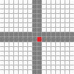

# AlignedAeroCrosshair

These are just the default crosshair cursor files that Windows ships with, but with the misaligned hotspots fixed using RWCursorEditor.

To replace, run 7zip with elevated priviledges (right click -> run as administrator) and use it to copy the three .cur files into the `C:/Windows/Cursors/` folder.

## Alignment

The hotspot will always be placed at the bottomright pixel of the centermost 2x2 px cluster. For example, a 48x48 variant with row/columns #0...#47 will have the hotspot located at row#24-column#24.

The line segments will always be centered at the centermost 2x2 for even-thickness crosshairs, and for odd-thickness crosshairs it will be centered at the bottomright pixel of the centermost cluster. 

In other words, the hotspot coincides with the exact center pixel for odd-thickness crosshairs, and the bottomright center pixel for even-thickness crosshairs.

Even | Odd 
-----|-----
 | 
